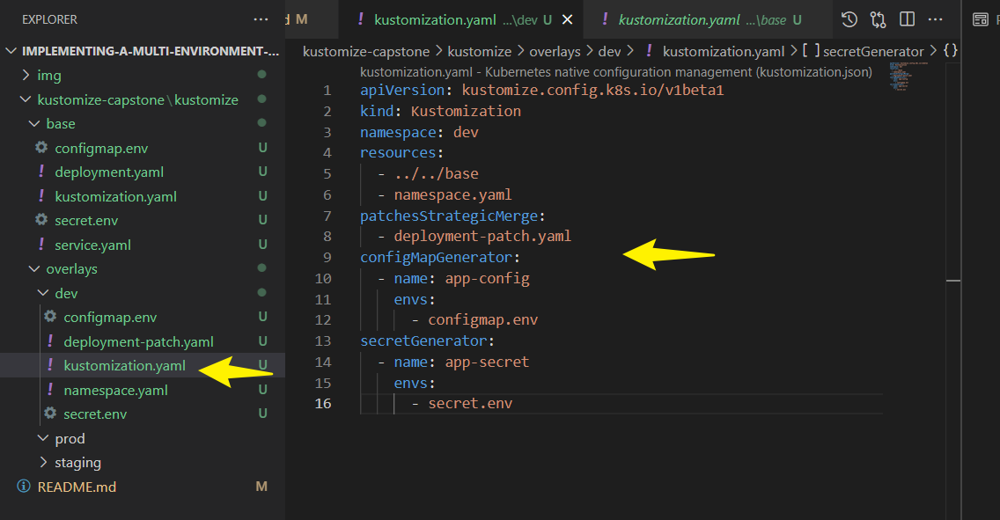
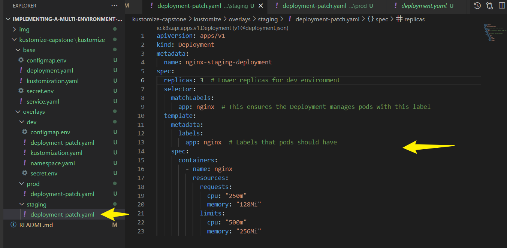

# Implementing-a-Multi-environment-Application-deployment-with-kustomize
---
## ✅ **Project Objectives**
1️⃣ **Implement modular Kubernetes configurations** using **Kustomize**  
2️⃣ **Automate CI/CD pipeline** with **GitHub Actions** for seamless deployments  
3️⃣ **Secure configuration management** via **ConfigMaps and Secrets** without hardcoding values  
4️⃣ **Ensure scalability & maintainability** with **environment-specific optimizations**  
5️⃣ **Deploy applications across separate Kubernetes namespaces** for isolation  

---

#### ✅ **Project Structure**
```
kustomize-capstone/
│── kustomize/
│   ├── base/                      # Common Kubernetes configurations
│   │   ├── deployment.yaml        # Base Nginx deployment
│   │   ├── service.yaml           # Kubernetes service
│   │   ├── configmap.env          # Environment configurations (external file)
│   │   ├── secret.env             # Secure credentials (external file)
│   │   ├── kustomization.yaml     # Kustomize base configurations
│   ├── overlays/                  # Environment-specific configurations
│   │   ├── dev/
│   │   │   ├── kustomization.yaml # Dev-specific configuration
│   │   │   ├── deployment-patch.yaml # Modify replicas/resource limits for Dev
│   │   │   ├── configmap.env     # Dev-specific ConfigMap values
│   │   │   ├── secret.env        # Dev-specific Secrets values
│   │   │   ├── namespace.yaml    # Defines separate Dev namespace
│   │   ├── staging/
│   │   │   ├── kustomization.yaml # Staging-specific configuration
│   │   │   ├── deployment-patch.yaml # Modify replicas/resource limits for Staging
│   │   │   ├── configmap.env     # Staging-specific ConfigMap values
│   │   │   ├── secret.env        # Staging-specific Secrets values
│   │   │   ├── namespace.yaml    # Defines separate Staging namespace
│   │   ├── prod/
│   │   │   ├── kustomization.yaml # Production-specific configuration
│   │   │   ├── deployment-patch.yaml # Modify replicas/resource limits for Production
│   │   │   ├── configmap.env     # Production-specific ConfigMap values
│   │   │   ├── secret.env        # Production-specific Secrets values
│   │   │   ├── namespace.yaml    # Defines separate Production namespace
│── .github/workflows/deploy.yml    # GitHub Actions CI/CD Pipeline
│── Dockerfile                      # Dockerized application setup
│── README.md                        # Documentation and setup instructions
│── .gitignore                        # Ignore unnecessary files
│── LICENSE                          # Open-source licensing information
```
✔ **This structured approach ensures modularity, scalability, and maintainability**.

---

#### **Task 1: Set Up the Project Directory**
```sh
mkdir kustomize-capstone && cd kustomize-capstone
mkdir -p kustomize/{base,overlays/dev,overlays/staging,overlays/prod}
```
✔ Creates **base and overlays** directories for Kubernetes configurations.

---

## ✅ **Task 2: Initialize Git Repository**
```sh
git init
echo "node_modules/" >> .gitignore
echo ".DS_Store" >> .gitignore
git add .gitignore
git commit -m "Initialized repository with .gitignore"
```
✔ Ensures unnecessary files **are ignored from Git tracking**.

---

#### **Task 3: Define Base Kubernetes Configurations**
#### **Base Deployment (`kustomize/base/deployment.yaml`)**
```yaml
apiVersion: apps/v1  # API version for the deployment object
kind: Deployment      # Specifies that this is a Deployment
metadata:
  name: nginx         # Name of the deployment
spec:                    # Specification of the deployment
  replicas: 2            # Number of replicas (pods running)
  selector:              # Selector to identify the pods
    matchLabels:
      app: nginx
  template:              # Template for pod creation
    metadata:
      labels:
        app: nginx       # Label applied to the pod
    spec:
      containers:
      - name: nginx      # Name of the container
        image: nginx:stable  # Updated to stable NGINX version
        ports:
          - containerPort: 80  # Port the container will expose
        resources:
            requests:
              memory: "128Mi"
              cpu: "250m"
            limits:
              memory: "512Mi"
              cpu: "1000m"
        envFrom:                   # Dynamically load environment variables
          - configMapRef:
              name: app-config
          - secretRef:
              name: app-secret
        livenessProbe:              # Ensures container is running
          httpGet:
            path: /
            port: 80
          initialDelaySeconds: 3
          periodSeconds: 10
        readinessProbe:             # Ensures container is ready to serve traffic
          httpGet:
            path: /
            port: 80
          initialDelaySeconds: 5
          periodSeconds: 10
```


✔ **Uses environment variables from ConfigMaps and Secrets**.

#### **Base Service (`kustomize/base/service.yaml`)**
```yaml
apiVersion: v1
kind: Service
metadata:
  name: nginx-service
spec:
  selector:
    app: nginx
  ports:
    - protocol: TCP
      port: 80
      targetPort: 80
  type: ClusterIP
```


✔ **Exposes the application inside the cluster**.

---

#### **`configmap.env`** (Environment Configurations)
```txt
NGINX_PORT=80
NGINX_WORKERS=2
```


#### **`secret.env`** (Secure Credentials)
```txt
ADMIN_USERNAME=admin
ADMIN_PASSWORD=SuperSecretPassword
```


#### **`kustomization.yaml`** (Kustomize Configuration)
```yaml
apiVersion: kustomize.config.k8s.io/v1beta1
kind: Kustomization
resources:
  - deployment.yaml
  - service.yaml
configMapGenerator:
  - name: app-config
    envs:
      - configmap.env
secretGenerator:
  - name: app-secret
    envs:
      - secret.env
```


####  **Task 4: Implement Environment-Specific Overlays**
Each overlay has **namespace definitions** and customizations.

#### **Development Overlay (`kustomize/overlays/dev/kustomization.yaml`)**
```yaml
bases:
  - ../../base
resources:
  - namespace.yaml
patchesStrategicMerge:
  - deployment-patch.yaml
configMapGenerator:
  - name: app-config
    envs:
      - configmap.env
secretGenerator:
  - name: app-secret
    envs:
      - secret.env
namespace: dev
```


✔ Deploys resources into an **isolated namespace**.

---

#### **Step 1: Create the Overlay Directories**
Run the following commands to set up the structure:
```bash
mkdir -p overlays/dev overlays/staging overlays/prod
```
---
#### **Step 2: Define the Namespace for Each Environment**
Namespaces help segregate workloads in Kubernetes. Here's an example `namespace.yaml` file for `dev`:

#### **`overlays/dev/namespace.yaml`**
```yaml
apiVersion: v1
kind: Namespace
metadata:
  name: dev
```

Similarly, create `namespace.yaml` for `staging` and `prod` with their respective names.

---

#### **Step 3: Create Patches for Deployment Configuration**
Each overlay can modify the base deployment like changing replica count for scaling and any other desired config that needs patching.

#### ** `overlays/dev/deployment-patch.yaml`**
```yaml
apiVersion: apps/v1
kind: Deployment
metadata:
  name: nginx-dev-deployment
spec:
  replicas: 1  # Lower replicas for dev environment
  template:
    spec:
      containers:
        - name: nginx
          resources:
            requests:
              cpu: "250m"
              memory: "128Mi"
            limits:
              cpu: "500m"
              memory: "256Mi"
```

Similarly, `staging` may have medium-scale configurations, and `prod` can be highly scalable.


#### **`overlays/prod/deployment-patch.yaml`**

```yaml
apiVersion: apps/v1
kind: Deployment
metadata:
  name: nginx-prod-deployment
spec:
  replicas: 5  # Higher scale replicas for prod environment
  selector:
    matchLabels:
      app: nginx  # This ensures the Deployment manages pods with this label
  template:
    metadata:
      labels:
        app: nginx  # Labels that pods should have
    spec:
      containers:
        - name: nginx
          resources:
            requests:
              cpu: "250m"
              memory: "128Mi"
            limits:
              cpu: "1000m"
              memory: "512Mi"
```


#### **`overlays/staging/deployment-patch.yaml`**

```yaml
apiVersion: apps/v1
kind: Deployment
metadata:
  name: nginx-staging-deployment
spec:
  replicas: 5  # Meduim scale replicas for staging environment
  selector:
    matchLabels:
      app: nginx  # This ensures the Deployment manages pods with this label
  template:
    metadata:
      labels:
        app: nginx  # Labels that pods should have
    spec:
      containers:
        - name: nginx
          resources:
            requests:
              cpu: "250m"
              memory: "128Mi"
            limits:
              cpu: "1000m"
              memory: "512Mi"
```

---

#### **Step 4: Environment-Specific Configurations**
Each overlay can have separate `configmap.env` and `secret.env` files.

#### **`overlays/dev/configmap.env`**
```txt
NGINX_PORT=8080
NGINX_WORKERS=1
```

#### **`overlays/dev/secret.env`**
```txt
ADMIN_USERNAME=devadmin
ADMIN_PASSWORD=DevSecret123
```


Likewise, `staging/configmap.env` and `prod/configmap.env` can have different values.

#### **`overlays/prod/configmap.env`**
```txt
NGINX_PORT=8080
NGINX_WORKERS=1
```

#### **`overlays/prod/secret.env`**
```txt
ADMIN_USERNAME=devadmin
ADMIN_PASSWORD=DevSecret123
```


#### **`overlays/staging/configmap.env`**
```txt
NGINX_PORT=8080
NGINX_WORKERS=1
```

#### **`overlays/staging/secret.env`**
```txt
ADMIN_USERNAME=devadmin
ADMIN_PASSWORD=DevSecret123
```

---

Define the  **`kustomization.yaml`** files for **production** and **staging**, ensuring each environment correctly overlays the base configuration.

---

#### **Production (`overlays/prod/kustomization.yaml`)**
```yaml
apiVersion: kustomize.config.k8s.io/v1beta1
kind: Kustomization
namespace: prod
resources:
  - ../../base
  - namespace.yaml
patchesStrategicMerge:
  - deployment-patch.yaml
configMapGenerator:
  - name: app-config
    envs:
      - configmap.env
secretGenerator:
  - name: app-secret
    envs:
      - secret.env
```


- **Defines `namespace: prod`** to isolate production resources.
- **Uses `deployment-patch.yaml`** to apply production-specific scaling.
- **References `configmap.env` and `secret.env`**, ensuring production configurations are loaded.

---
#### **Staging (`overlays/staging/kustomization.yaml`)**
```yaml
apiVersion: kustomize.config.k8s.io/v1beta1
kind: Kustomization
namespace: staging
resources:
  - ../../base
  - namespace.yaml
patchesStrategicMerge:
  - deployment-patch.yaml
configMapGenerator:
  - name: app-config
    envs:
      - configmap.env
secretGenerator:
  - name: app-secret
    envs:
      - secret.env
```


- **Uses `namespace: staging`** for staging-specific separation.
- **`deployment-patch.yaml`** modifies replicas and resources for staging.
- **Loads staging-specific environment variables and secrets.**
---


**GitHub Actions workflow** that automates your Kubernetes deployment using Kustomize. This workflow ensures the deployment happens whenever changes are pushed to the `main` branch.  

### **Create `.github/workflows` Directory**
Ensure your GitHub Actions workflows are stored inside the `.github/workflows` folder.  
Run:

```bash
mkdir -p .github/workflows
```
Move your **workflow YAML file** (`deploy.yaml`) into this directory.


---

### **`.github/workflows/deploy.yaml`**

```yaml
name: Deploy to Kubernetes

on:
  push:
    branches:
      - main

jobs:
  deploy:
    runs-on: ubuntu-latest
    steps:
      - name: Checkout repository
        uses: actions/checkout@v3

      - name: Set up Kubernetes CLI
        uses: azure/setup-kubectl@v3

      - name: Configure Kubernetes credentials
        run: |
          echo "${{ secrets.KUBE_CONFIG }}" > kubeconfig.yaml
          export KUBECONFIG=kubeconfig.yaml

      - name: Apply Kustomize Deployment
        run: |
          kubectl apply -k overlays/prod

      - name: Check Deployment Status
        run: |
          kubectl rollout status deployment/nginx-deployment -n prod

      - name: Rollback on Failure
        if: failure()
        run: |
          kubectl rollout undo deployment/nginx-deployment -n prod
```
### **🔍 Explanation**
✅ **Triggers on push to `main`**  
✅ **Checks out the repository** to access the latest files  
✅ **Sets up `kubectl`** for interacting with the Kubernetes cluster  
✅ **Configures Kubernetes credentials** using GitHub Secrets (`KUBE_CONFIG`)  
✅ **Applies Kustomize deployment** targeting the **production overlay**  
✅ **Verifies deployment status** before marking success  
✅ **Rolls back automatically** if deployment fails  

To configure your repository for **GitHub Actions** and push your changes to GitHub, follow these steps:

---

### **Add & Commit Changes**
```bash
git add .
git commit -m "Add GitHub Actions for Kubernetes deployment"
```

---

### **Push to GitHub**
```bash
git push 
```
Once pushed, GitHub Actions should automatically trigger the deployment when changes are made to `main`.

---

### **Verify GitHub Actions Setup**
1. **Go to GitHub Repo → Actions Tab**  
2. Check if the workflow appears. If not, ensure the `.github/workflows/deploy.yaml` file is present.  

